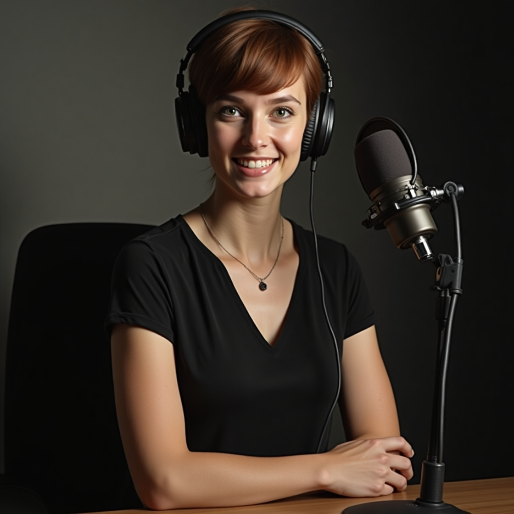

    <audio src="output/ElevenLabs_2025-01-16T10_12_34_Nichalia Schwartz_pvc_s35_sb100_se0_b_m2.mp3" controls title="Podcast editado"></audio>

# Projeto Podcast Gerado por I.A.s

 > ℹ️ *Este projeto foi criado para o bootcamp CAIXA - IA Generativa com Microsoft Copilot

## 💻 Tecnologias utilizadas no projeto

- [ChatGPT](https://chat.openai.com/) 
- [Leonardo AI](https://app.leonardo.ai/image-generation/)
- [ElevenLabs](https://beta.elevenlabs.io/)

## ✨ Como foi feito ?

- Roteiro gerado via chatgpt
- Audio gerado pela elevenLabs
- Leonardo AI Para gerar capas

⌨️ com 💜 por [Alice Galindo (https://github.com/Alicegcosta87)
